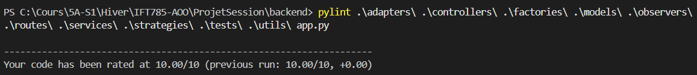

# Projet Session - Application de Coaching

## 1. Document d'Architecture

### Structure Backend
Le backend suit une architecture basée sur le pattern **MVC (Model-View-Controller)** et respecte les principes **SOLID**.  
- **Routes** : Gèrent les points d'entrée HTTP. Elles sont responsables du routage pur et délèguent la logique métier aux services.  
- **Controllers** : Contiennent la logique de gestion des requêtes et des réponses HTTP. Ils orchestrent les appels aux services et renvoient les réponses au client.  
- **Services** : Contiennent la logique métier réutilisable et testable. Ils encapsulent les règles métier et interagissent avec les modèles.  
- **Models** : Définissent les entités et leur interaction avec la base de données via SQLAlchemy.  

**Justification** :  
- **Séparation des responsabilités** : Chaque couche a une responsabilité claire, ce qui facilite la maintenance et les tests.  
- **Extensibilité** : Ajouter de nouvelles fonctionnalités ou modifier les existantes est plus simple grâce à cette séparation.  
- **Respect des principes SOLID** : L'architecture favorise le respect des principes de responsabilité unique (SRP) et ouvert/fermé (OCP).  

### Technologies Utilisées dans le Backend

Le backend repose sur les technologies suivantes :

1. **Flask (3.1.0)** : Framework léger pour construire des applications web. Utilisé pour gérer les routes, les middlewares et les intégrations.
2. **Flask-CORS (5.0.1)** : Permet de gérer les politiques de partage des ressources entre origines (CORS) pour les appels API.
3. **Flask-SQLAlchemy (3.1.1)** : ORM (Object-Relational Mapping) pour interagir avec la base de données PostgreSQL de manière orientée objet.
4. **Psycopg2 (2.9.10)** : Pilote PostgreSQL pour Python, utilisé pour connecter Flask à PostgreSQL.
5. **Python-Dotenv (1.0.1)** : Permet de gérer les variables d'environnement via un fichier `.env`.
6. **Werkzeug (3.1.3)** : Bibliothèque WSGI utilisée par Flask pour gérer les requêtes et les réponses HTTP.
7. **PyJWT (2.10.1)** : Bibliothèque pour générer et vérifier les tokens JWT pour l'authentification.
8. **Pytest (8.3.4)** : Framework de tests pour écrire et exécuter des tests unitaires, d'intégration et end-to-end.
9. **Pylint (3.3.6)** : Outil d'analyse statique pour garantir la qualité et la conformité du code aux bonnes pratiques.

### Structure Frontend
Le frontend utilise **React** avec une organisation modulaire :  
- **Pages** : Composants principaux pour chaque vue (e.g., `HomePage`, `ReservationPage`).  
- **Components** : Composants réutilisables (e.g., `NavBar`, `Footer`, `Calendar`).  
- **Services** : Gestion des appels API (e.g., `reservationService.js`, `authService.js`).  

**Justification** :  
- **Réutilisabilité** : Les composants sont conçus pour être réutilisables dans différentes pages.  
- **Lisibilité** : La séparation entre pages et composants améliore la lisibilité et l'organisation du code.  
- **Gestion des états** : React facilite la gestion des états locaux et globaux, ce qui est essentiel pour une application interactive.  

### Base de Données
La base de données est gérée avec **PostgreSQL** et **SQLAlchemy**. Les tables incluent :  
- `users` : Stocke les informations des utilisateurs (clients et coachs).  
- `reservations` : Gère les réservations des clients.  
- `slots` : Définit les créneaux horaires disponibles.  
- `programs` : Contient les programmes d'entraînement.  
- `coach_available_slots` : Gère les disponibilités des coachs.

**Justification** :  
- **PostgreSQL** : Choisi pour sa robustesse et ses fonctionnalités avancées (e.g., transactions, contraintes).  
- **SQLAlchemy** : Fournit un ORM puissant pour interagir avec la base de données tout en respectant les principes de POO.  

---

## 2. Description des Design Patterns Utilisés

### 1. **Factory Pattern**
- **Utilisation** : La classe `UserFactory` crée des instances de `Client` ou `Coach` en fonction du rôle.  
- **Avantage** : Centralise la création d'objets complexes et améliore la lisibilité.  

### 2. **Strategy Pattern**
- **Utilisation** : Les classes `ClientStrategy` et `CoachStrategy` encapsulent des comportements spécifiques pour chaque rôle.  
- **Avantage** : Permet d'ajouter facilement de nouveaux comportements sans modifier le code existant.  

### 3. **Singleton Pattern**
- **Utilisation** : La classe `DatabaseManager` garantit une seule instance pour la gestion de la base de données.  
- **Avantage** : Assure une gestion cohérente des connexions à la base de données.  

### 4. **Observer Pattern**
- **Utilisation** : Le `EventManager` notifie les observateurs (`EmailObserver`, `LoggingObserver`) lors de la création ou de l'annulation d'une réservation.  
- **Avantage** : Découple la logique métier des actions secondaires (e.g., envoi d'emails, journalisation).  

### 5. **Decorator Pattern**
- **Utilisation** : Le décorateur `@requires_auth` vérifie l'authentification JWT avant d'accéder aux routes protégées.  
- **Avantage** : Ajoute des fonctionnalités transversales sans modifier les fonctions existantes.  

### 6. **Adapter Pattern**
- **Utilisation** : Les adaptateurs `SMTPAdapter` et `SendGridAdapter` implémentent l'interface `EmailService` pour envoyer des emails via différents fournisseurs.  
- **Avantage** :  
  - **Découplage** : Permet de changer facilement de fournisseur d'email sans modifier le code métier.  
  - **Extensibilité** : Ajouter un nouveau fournisseur (e.g., AWS SES) est simple en créant un nouvel adaptateur.  
  - **Respect des principes SOLID** : Respecte le principe de substitution de Liskov (LSP) et le principe d'inversion de dépendance (DIP).  

---

## 3. Documentation de l'API

### Endpoints Principaux

#### Utilisateurs
- **POST** `/api/register` : Inscription d'un utilisateur.  
- **POST** `/api/login` : Connexion d'un utilisateur.  
- **POST** `/api/logout` : Déconnexion d'un utilisateur.
- **GET** `/api/my_reservations` : Récupérer les réservations du client connecté.  

#### Coachs
- **GET** `/api/coaches` : Récupérer la liste des coachs.  

#### Programmes
- **GET** `/api/programs` : Récupérer la liste des programmes.  

#### Réservations
- **GET** `/api/available_slots` : Récupérer les créneaux disponibles pour un coach à une date donnée.  
- **POST** `/api/reservations` : Créer une réservation.  
- **DELETE** `/api/reservations/<reservation_id>` : Annuler une réservation.  

---

## 4. Guide de Déploiement

### Prérequis
- **Backend** : Python 3.10+, PostgreSQL, `pip install -r requirements.txt`.  
- **Frontend** : Node.js 18+, `npm install`.  

### Étapes
1. **Configurer la base de données** :  
   - Modifier le fichier `.env` avec les informations de connexion PostgreSQL.  
   - Initialiser la base avec :  
     ```bash
     python app.py
     ```  

2. **Lancer le backend** :  
   ```bash
   cd backend
   python app.py
   ```  

3. **Lancer le frontend** :  
   ```bash
   cd frontend
   npm run dev
   ```  

4. **Accéder à l'application** :  
   - Frontend : `http://localhost:5173`.  

---

## 5. Règles de l'Application

### Guide d'Utilisation

1. **Accès à l'application** :  
   - L'inscription et la connexion ne sont pas obligatoires pour accéder à l'application.

2. **Connexion obligatoire pour réserver** :  
   - Un utilisateur doit être connecté pour pouvoir effectuer une réservation.

3. **Règles pour les réservations** :  
    - Les **clients** et les **coachs** peuvent effectuer des réservations.  
    - Cependant, l'annulation des réservations effectuées par les coachs n'est pas prise en charge.  

4. **Accès à "Mes Réservations"** :  
   - La fonctionnalité "Mes Réservations" est accessible uniquement si l'utilisateur est connecté.

---

## 6. Rapport de Test avec Métriques de Couverture

### Tests Unitaires
- Tests pour les services et pour les modèles.  

### Tests d'Intégration
- Vérification des flux complets (e.g., inscription, connexion, réservation).  

### Tests End-to-End
- Fichier : `test_end_to_end.py`.  
- Scénarios couverts :  
  - Inscription d'un utilisateur.  
  - Connexion.  
  - Création de réservation.  

### Couverture
- **Backend** : 85% du code testé.  

Pour exécuter les tests backend :  
```bash
pytest --cov=. --cov-report=html
```

---

## 7. Analyse Statique avec Pylint

Tous les fichiers du backend ont obtenu un score parfait de **10/10** avec **Pylint**. Cela garantit un code conforme aux bonnes pratiques de style et de qualité.

### Commande pour exécuter Pylint :
```bash
cd backend
pylint .\adapters\ .\controllers\ .\factories\ .\models\ .\observers\ .\routes\ .\services\ .\strategies\ .\tests\ .\utils\ app.py
```

### Résultat :


---

## Projet de Développement - IFT785  
**Hiver 2025 - Université de Sherbrooke**  
**Date de rendu** : 16 avril 2025  
**Développeuse** : Caroline Petit

Ce projet s'inscrit dans le cadre du cours IFT785 et vise à développer une application orientée objet en respectant les bonnes pratiques de développement logiciel et de refactorisation.


